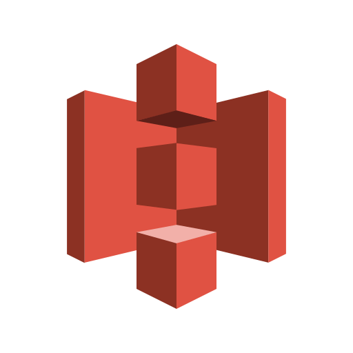
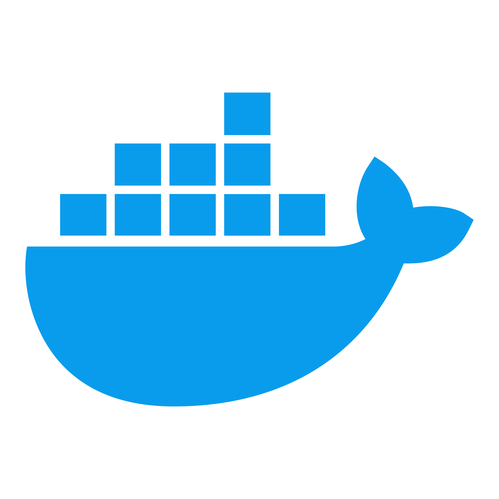

## 🧑‍💻 About me

Java와 Spring 기반의 백엔드 개발자를 지향하는 장성우입니다.

새로운 기술이나 익숙하지 않은 구조도 공식 문서와 예제를 바탕으로 직접 검증하며 해결하는 것을 좋아합니다.
MSA 기반 온라인 서점과 AI 기반 고전문학 콘텐츠 서비스를 개발하며 REST API, DB 설계, 인증/인가, 비동기 처리, 메시지 큐, CI/CD, Docker 기반 배포를 경험했습니다.

기능 구현에 그치지 않고, 협업 가능한 구조와 안정적인 운영 흐름을 함께 고민하는 백엔드 개발자로 성장하고자 합니다.

---

## 📋 Activities

* **멋쟁이사자처럼 대학**
  `(2024.03. ~ 2024.12.)`

* **디지털새싹캠프 보조강사**
  `(2023.07. ~ 2025.07.)`

* **NHN Academy Java Backend 12기**
  `(2025.07. ~ 2026.01.)`

* **삼성 청년 SW·AI 아카데미 15기**
  `(2026.01. ~ 2026.12.)`

---

## 🏅 Certificates

* `(2025.12.)` **정보처리기사** - 한국산업인력공단 - Pass
* `(2024.11.)` **SQLD** - 한국데이터산업진흥원 - Pass
* `(2026.06.)` **AWS Certified Solutions Architect - Associate, SAA-C03** - Amazon Web Services - Pass
* `(2026.06.)` **ADsP** - 한국데이터산업진흥원 - Pass
---

## 🚀 Projects

### [HighFiveBooks](https://github.com/nhnacademy-be12-high-five?view_as=public)

`2025.11. ~ 2026.01.`

MSA 기반 온라인 서점 서비스입니다.
도서, 회원, 쿠폰, 주문, 결제 서비스를 분리해 개발했으며, 저는 주문 도메인 백엔드 개발과 인프라/배포를 담당했습니다.

* 주문·결제 데이터 정합성을 위한 TCC 패턴 적용
* RabbitMQ 기반 결제 성공 이벤트 비동기 처리
* Spring Scheduler 기반 주문 상태 자동화
* Docker, GitHub Actions 기반 CI/CD 및 배포 자동화

---

### [BookTown](https://github.com/BookTown/BookTown)

`2025.03. ~ 2025.06.`

AI 기반 고전문학 그림책 감상 및 퀴즈 학습 서비스입니다.
고전문학 원문을 수집해 AI로 요약하고, 장면별 일러스트와 TTS 음성을 생성하는 콘텐츠 파이프라인을 구현했습니다.
저는 팀장, 백엔드 개발, AI API 연동, 인증/인가, S3 파일 저장, Docker 기반 배포를 담당했습니다.

* Spring AI 기반 고전문학 요약 및 장면 생성
* Stability AI, Google Cloud TTS 연동
* CompletableFuture 기반 외부 API 호출 비동기 처리
* Spring Security, JWT, OAuth2 기반 인증/인가 구현
* AWS S3 파일 저장 및 Docker/Nginx 기반 배포

---

## 🛠 Tech Stack

<table>
  <tr>
    <td align="center"><strong>Backend</strong></td>
    <td>
      

        
        &nbsp;
        
        &nbsp;
        
        &nbsp;
        
         
      

    </td>
  </tr>

  <tr>
    <td align="center"><strong>Infra</strong></td>
    <td>
      

        
        &nbsp;
        
        &nbsp;
        
        &nbsp;
        
        &nbsp;
        
         
      

    </td>
  </tr>
</table>

---

